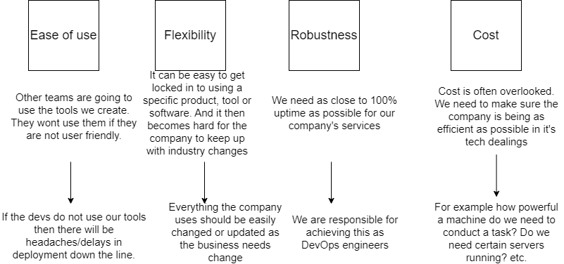

### What is DevOps?

DevOps is a set of practices, tools, and a cultural philosophy that automate and integrate the processes between software development and IT teams.

DevOps can be visualised by the image below:

### Benefits of DevOps? Benefits for businesses?

The main benefits of DevOps for businesses are:
- Speed of deliverables.
- Improved Collaboration.
- Rapid deployment.
- Quality and reliability.
- Security.

### What does the role entail?

The role will commonly entail the following responsibilities:
- Application and infrastructure planning, testing and development.
- Maintaining CI/CD pipelines.
- Implementing automation.
- Monitoring for continuous improvement.

### Who do DevOps Engineers work with?

A DevOps engineer will typically work with software developers and IT operations personnel.

### What other teams does a DevOps Engineer interact with?

DevOps engineers will also inevitably interact with system users and management.

### What are their common deliverables?

Some of the common deliverables for a DevOps engineer are ensuring pipelines are running smoothly and efficiently, monitoring systems for continuous improvement and general infrastructure management.

### What is the value of a DevOps Engineer?

The value of a DevOps engineer to an organisation is increasing speed of delivering products and services.

### How do DevOps Engineers fit into the SDLC?

DevOps fits into the whole of the SDLC as a culture to increase collaboration and delivery of products and services.

### Where can you progress from here?

DevOps roles are varied and vast, the role can generally progress into:
- DevOps Architect
- Automation Engineer
- Software Tester
- Security Engineer
- Integration Specialist
- Release Manager

### What is Cloud Computing?

Cloud computing is the on-demand availability of computing resources as services over the internet.

### Who is using DevOps? – Case studies (2-4 total, simple overview of how they use it, no need for depth).

Just Eat implemented a large DevOps shortly after being found and quickly realised the importance of the role through migrating their local data centres to the cloud. This allowed Just Eat to scale their business with required hardware to process now up to 1200 orders per minute.

Etsy is a company that adopted a DevOps team early on in the industry as they struggled to develop the organisation due to their monolithic architecture. However, after bringing in a new CTO who implemented DevOps practices they were able to increase their deployment rate from 2 times a week to 50-100 times a day.

### What are the DevOps pillars?

